# A Delta-Hedged Uniswap v3 Liquidity Position, Backtested on Real Data

## A guide for an options trader who has never touched a blockchain

Written 2026-09-06 against the deployed application at https://backtest-lp-production.up.railway.app/ (commit `e1bb6e7`, "ux updates", 2026-08-31) and the real August 2026 data described in section 2. Every number in this guide was produced by running the application's own code in this session. Nothing is synthetic. The raw output behind every number is in `docs/guide/raw/`, the data checks in `DATA.md`, every scenario in `SCENARIOS.md`, every widget in `APP_MAP.md`, every formula check in `SOURCES.md`, and the environment in `ENVIRONMENT.md`.

The answer, up front. A 1,000,000 USD position in the ETH/USDC 0.05% pool with a ±15% range, delta-hedged with a Binance perpetual on a 3% band, lost 11,592 USD over the 31 days of August 2026 on a capital base of 1,198,120 USD. Annualised, −11.39%. Fees were 28,956 USD. The gamma cost of the hedged inventory was 37,962 USD. ETH rose 32% in the month with 52% realised vol. Sections 7 to 9 say what that does and does not tell you.

---

## 0. What this is and how to run it

### 0.1 The application

The application is a web page that backtests one strategy: provide liquidity to a Uniswap v3 pool inside a price band and short the position's delta on a perpetual future. It asks one question and answers it with a green or red banner: do the fees cover the cost of running the position hedged.


The first screen shows a sidebar with collapsed sections named `Fetch data`, `Save / load config`, then `Engine`, `Data source`, `Backtest window`, `Position sizing`, `Hedge policy`, `Cost model`, `Mechanics (advanced)`, `Analysis + Run`, and a main area with two tabs, `Backtest` and `Documentation`. The engine defaults to `swap_level (reference)` and the data source to `Demo (synthetic tape)`. Nothing runs until `Run backtest` is clicked.

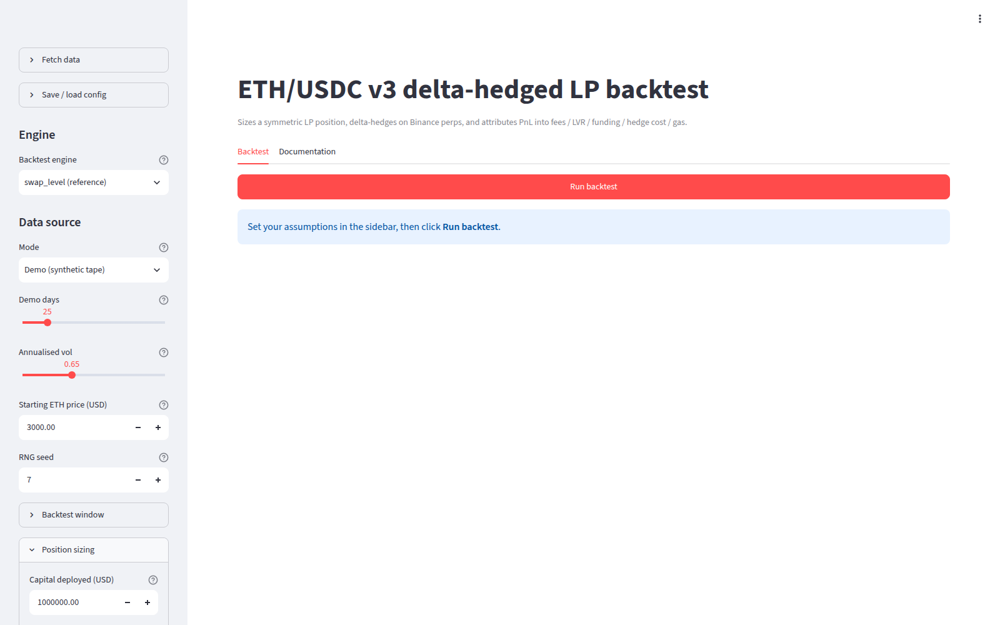

### 0.2 Running it yourself

The deployment runs the code in the repository `https://github.com/nhaga/backtest-lp` (this guide was produced in the fork `noemonf1/backtest-lp`). To run it locally:

```
git clone https://github.com/nhaga/backtest-lp
cd backtest-lp
git checkout e1bb6e786aef0ba025b260b288943c4b01c04d1a
pip install "streamlit==1.61.1" "plotly==6.9.0" "pyarrow==24.0.0" "pandas==3.0.2" "numpy==2.4.4" requests pytest
python3 -m pytest tests/ -q          # 39 passed in 8.02s
streamlit run app.py --server.headless true --server.port 8501
```

The page is then at `http://127.0.0.1:8501`. The repository's `requirements.txt` pins `pandas==3.0.5` and `numpy==2.5.1`, which do not exist on PyPI; the versions above are the ones that install and pass the test suite (ENVIRONMENT.md). Python 3.11.15 was used.

### 0.3 The sidebar, control by control

Every control does exactly one of four things. It picks the **data** the run reads. It changes the **position** (how much liquidity, struck where, re-struck when). It changes the **hedge policy** (how often you trade the perp and how far you let delta drift). Or it changes a **cost assumption**. Nothing else in the sidebar affects a number. Four controls do nothing at all in some modes, listed in Appendix A.

Two quantities recur below, so define them once.

- **L (liquidity)** is the position's size parameter. The engine sets it by `L = capital / value(L = 1)` at the entry price (run_claude.py:232-234). Value scales linearly in L, so L is the position's notional in Uniswap units. A narrower band gives more L per dollar, because the same dollars are spread over less price space.
- **Max delta** is the ETH the position holds when the price sits at or below the bottom of its band, `L_h × (1/√P_lo − 1/√P_hi)` (run_claude.py:187-190). At the default t0 it is 561.24 ETH against an entry delta of 249.25. It is the position's delta range, and the hedge band is quoted as a fraction of it.

#### 0.3.1 Engine and data source

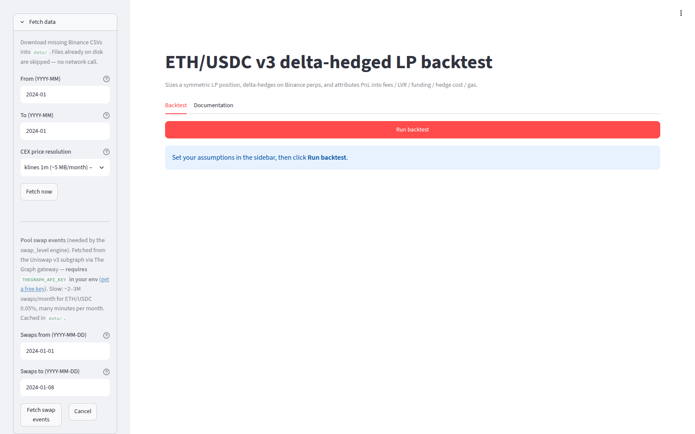

`Fetch data` only downloads files. It changes no number in a backtest. Section 0.4 walks through it.

| Control | What the choice means | How it enters the calculation | On the August data |
|---|---|---|---|
| Backtest engine | `swap_level` prices every individual pool trade against the exchange. `hourly` reads 1-hour bars and estimates fees from a volume guess. | Picks `bt.run_swap_level` or `bt.run_hourly` (app.py:1938, 1967). The hourly engine has no LVR term at all and books realised hedge P&L with the wrong sign. | swap_level −11,592 USD. hourly +69,274 USD, which is wrong (section 8.2). Use swap_level. |
| Mode (swap_level) | `Demo` generates a fake price path and fake trades. `Real data (files)` reads the three files below. | Demo calls `make_demo_data` (run_claude.py:363); the run then carries a yellow "numbers do NOT reflect real PnL" banner. | This guide never uses Demo. |
| Demo days, Annualised vol, Starting ETH price, RNG seed | The four parameters of the synthetic tape: how long, how volatile, from what price, and which random draw. | Passed straight to the geometric Brownian generator (run_claude.py:363-378). Changing the seed changes the answer with everything else fixed. | Not used. |
| Swaps file | Which pool-trade tape to price against. This is the fee and adverse-selection source. | `bt.load_swaps` then per-swap attribution (run_claude.py:458-535). | 159,990 swaps, August 2026. |
| CEX price file | Which exchange tape marks the position, prices the hedge and defines "fair" for LVR. 1-minute bars are coarse, aggTrades is every trade. | Resampled to 1 second and forward-filled (run_claude.py:295-315). A 1-minute bar means the mark can be 59 seconds stale when a swap is priced. | Changes net by 9 USD. Changes the reported LVR from −4,134 to +34,360 (section 6). This is the most consequential file choice in the app. |
| Funding file | Whether the perp carry is counted. `(none — assume 0)` sets it to zero. | Each 8-hour print becomes `−(hedge × price) × rate` on the nearest grid row (run_claude.py:645-660). | With funding −11,592. Without it −13,086. |

#### 0.3.2 Backtest window

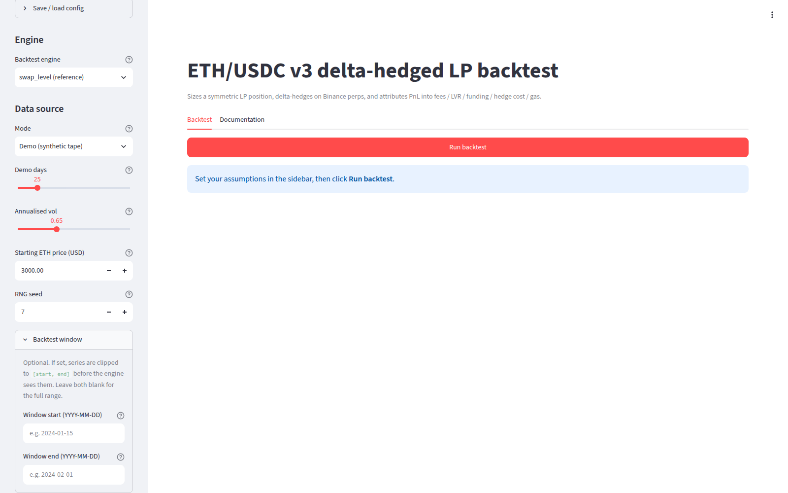

Two dates that clip every loaded series before the engine sees them (app.py:1028-1042). Empty means the whole file. Use it to test a sub-period without re-downloading. The end date is exclusive of the day you name, which the help text does not say (Appendix A, C8). Clipping changes the entry price, so the whole position is re-struck around a different spot: the four weekly runs in section 8.10 are nothing but this control moved four times, and they range from +1.35% to −34% annualised.

#### 0.3.3 Position sizing


| Control | What the choice means | How it enters the calculation | On the August data |
|---|---|---|---|
| Capital deployed (USD) | The dollars in the LP leg. It does not include hedge margin, which is added on top for the APR denominator. | Sets L (run_claude.py:232-234). Fees, LVR and hedge size all scale with L, so most terms are near-linear in capital. The exception is your share of the pool. | 100k to 10M: fee APR falls 29.3% to 22.4%, net APR falls −11.0% to −20.6% (section 8.7). |
| Range width (± fraction around spot) | The two strikes of the strangle, as a percentage band around the entry price. 0.15 means 1,583 to 2,143 at an entry of 1,862.68. | Converted to tick bounds, then L is solved for the capital (run_claude.py:219-234). Bounds are rounded outward to multiples of 10 ticks, which is 0.1% steps. | ±2% earns 4.2x the fees of ±15% and loses 11x as much: −129,455 against −11,592 (section 8.3). |
| Reposition when out of range? | Whether to re-strike the strangle around the new spot after the price leaves the band, or to sit in one token and stop earning. | `build_position_schedule` walks the price grid and re-strikes when triggered (run_claude.py:557-575). Off means one position for the whole window. | On: 98.2% of flow in range, net −11,592. Off: 44.5% in range, net −8,812. In a trending month, not re-striking lost less (section 8.9). |
| Reposition buffer (hours) | How long the price must stay outside the band before you accept the break and re-strike. It is a whipsaw filter. | The out-of-range clock resets on any re-entry; only a continuous stay longer than the buffer triggers (run_claude.py:558-570). | 6 hours. ETH left the band on Aug 19 and the re-strike fired on Aug 20 at 02:50. |

The intuition on range width is the whole strategy in one line. Concentrating your dollars into a narrow band buys you more fee share per dollar and more gamma per dollar in the same proportion. You are not choosing between more income and more risk. You are choosing the scale of both at once, and the market decides which one wins.

For the `hourly` engine this expander shows different controls: absolute price bounds instead of a width, plus `Our share of pool active liquidity` and `Pool volume as fraction of Binance quote volume`. Those two are the hourly engine's substitute for a real swap tape. It multiplies a guessed pool volume by a guessed share to invent a fee number. Both defaults are far from what August actually was: the share default 0.001 against a measured 0.02655, the volume multiplier 0.08 against a measured 0.01023 (section 8.2).

#### 0.3.4 Hedge policy

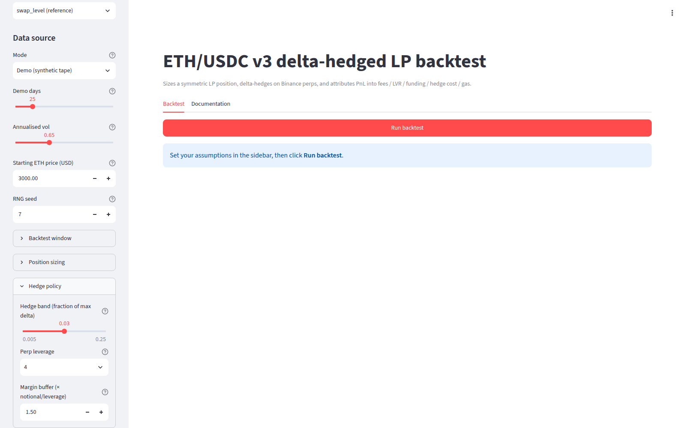

| Control | What the choice means | How it enters the calculation | On the August data |
|---|---|---|---|
| Hedge band (fraction of max delta) | The dead zone. You rehedge only when your residual delta exceeds this fraction of the position's full delta range. | `band = hedge_band × max_delta`, and the engine trades only when `abs(lp_delta + hedge) > band` on a grid row (run_claude.py:610-620). At the default, 3% of 561.24 ETH is a 16.84 ETH tolerance. | 0.5%: 3,218 trades, 13,390 USD of execution. 10%: 15 trades, 1,492 USD, but a worse drawdown (section 8.4). |
| Perp leverage | How much margin you post against the perp short. | Only `margin = max_notional / leverage × margin_buffer` (run_claude.py:720). It is the APR denominator and nothing else. No liquidation, no margin call, no funding on margin is modelled. | Every leverage gives net −11,592 USD. Only the APR moves, −7.61% at 1x to −12.65% at 10x (section 8.8). |
| Margin buffer | An extra collateral multiple on top of the leverage requirement, for liquidation safety. | Multiplies the margin, same denominator effect. | Default 1.5. Margin 198,120 USD on a peak notional of 528,320. |

The hedge band is the familiar rehedge-frequency trade-off, expressed in a fixed number of ETH rather than in delta percent or dollars. Tight band, small tracking error, large execution bill. Wide band, cheap, but you carry unhedged gamma between trades. The band does not change your fees or your gamma cost at all: across the whole sweep, fees stayed at 28,956 and LVR at −4,134 in every row. It only changes what you pay to track.

For `hourly`, this expander instead offers `Rebalance mode` (threshold or periodic), a threshold quoted as a fraction of current delta rather than max delta, and a fixed period in hours.

#### 0.3.5 Cost model

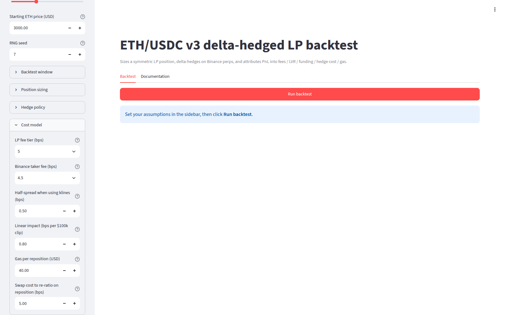

| Control | What the choice means | How it enters the calculation | On the August data |
|---|---|---|---|
| LP fee tier (bps) | The fee the pool charges takers, which is your gross income rate. | Two places: your fee is `tier × gross input × your share` (run_claude.py:511-513), and the taker's execution price for the LVR measure is computed net of the same tier (517-522). | Sweeping it is incoherent because the tape is flow that chose a 5 bp pool (section 8.6). Leave it at the pool's own tier. |
| Binance taker fee (bps) | Your commission per hedge trade. | `cost = notional × (half_spread + taker) / 1e4` (run_claude.py:623-624). | 4.5 bps of 6,355,283 USD turnover. |
| Half-spread when using klines (bps) | The half bid-ask you cross on every hedge trade, since a bar file has no book. | Same line as the taker fee. Applied for every price source, not only klines (Appendix A, C15). | 0.5 bps. Together with the taker fee, 3,178 USD of the 3,540 execution cost. |
| Linear impact (bps per $100k clip) | How much your own hedge order moves the perp against you, per 100,000 USD of clip. | `cost += notional × (notional / 1e5) × impact / 1e4` (run_claude.py:625). Note the notional appears twice, so the cost is quadratic in clip size and the bps rate rises with the clip. | 362 USD of 3,540 at 1M capital. 36,204 of 67,982 at 10M, where the mean clip is 424k. It equals the spread and fee only above a 625,000 USD clip. |
| Gas per reposition (USD) | The chain transaction fee to close and reopen the position. | Charged once per re-strike (run_claude.py:571, 693). | 40 USD, once. |
| Swap cost to re-ratio on reposition (bps) | The one people miss. When the price leaves your band, your inventory is 100% one token: all USDC if the price ran up through the top. A new band centred on the new spot needs roughly 54/46 USDC and ETH again, so you must go and buy the ETH back in the market. This charge is that round trip, quoted in bps of position value. | Deducted from the position value at the re-strike (run_claude.py:570), and then added again in the gas column (694). | 5 bps of 1,033,725 = 516.86 USD, plus 40 gas = 556.86. The gas column then books another 540 (which is 5 bps of the initial capital, not the current). The one re-strike is charged 1,096.86 USD for a 556.86 USD event. |

So a re-strike costs you three things: the chain fee, the market cost of re-ratioing the inventory, and the fact that you are re-opening a short-gamma position at a new strike, which is the real cost and is not in this expander at all.

#### 0.3.6 Mechanics (advanced)


| Control | What the choice means | How it enters the calculation | On the August data |
|---|---|---|---|
| Hedge decision grid (s) | How often you look at the position and decide whether to trade. It is the simulation's clock. | Three jobs at once (run_claude.py:548, 596, 679): the price series is resampled to this interval, the hedge decision is made on it, the LP is marked on it, and per-swap fees are aggregated into it. | 10 s and 30 s give the same answer as 60 s, because a 1-minute price file only changes once a minute. Coarser grids (300 s) hedge less and lost less on this tape (section 8.5). |
| Fee markout window (s) | The horizon at which you judge each swap. 0 means score the trade at the moment it happened. 300 means score it against the price five minutes later. | Sets the timestamp used to look up the exchange price for every swap: both the USD conversion of ETH-side fees and the whole LVR measure (run_claude.py:491-496). | 0 gives LVR −4,134 on a 1-minute file. 60 s gives +36,655. It does not touch net P&L, only the attribution (section 6). |

Markout is the market maker's own diagnostic. A fill that looks flat at the touch and bad thirty seconds later was adverse. Here it is being used to work around a stale price file. With a 1-second aggTrades tape the correct setting is 0.

#### 0.3.7 Analysis and Run


These four do not change the run. They add work after it.

**Run range × hedge-band sweep.** Runs the entire backtest once per cell of a two-dimensional grid and draws a heatmap of net APR. The name is stale: you pick both axes from six fields (range width, hedge band, fee tier, taker fee, leverage, hedge grid) and type your own values, so it is a general two-parameter sweep. The default grid is 5 hedge bands by 6 range widths, so 30 full backtests, which took 15.8 seconds on the August files. What it is for: seeing whether your parameter choice sits on a plateau or on a spike. What to watch: the app prints a "Best cell" callout, and on one month of data that callout is noise. Its winner was the ±50% range with a 5% band, a cell that traded four times in 31 days; its neighbour at a 10% band traded twice and shows −8.73%. One trade's timing separates them.

**Rolling-window distribution (30d).** Takes the daily net P&L, sums each trailing 30-day window, divides by the capital base and annualises by 365/30, then shows that series and its min, quartiles, median and max (app.py:1172-1180). The question it answers is regime stability: not "what did this make over my sample" but "what would it have made over each 30-day stretch inside my sample", which is the honest way to look at a backtest that has one headline number. It needs many months to say anything. On 31 days of data there are two windows and the table reads min −11.62, max −11.57. That is the same number printed twice.

**Backtest by month.** Splits the loaded data into calendar months and runs one full backtest per month, then plots monthly net APR bars (app.py:1655-1802). Months with fewer than 5 days or 100 swaps are skipped. Same purpose as the rolling window, coarser and easier to read. With one month loaded it prints "need at least 2 for a monthly breakdown" and produces nothing.

**Stress test (price shock).** Appears only when the `hourly` engine is selected. It multiplies the last N days of the price bars by a ramp or a step of your chosen size, then re-runs. The swap tape is untouched, so fees do not respond to the shock at all. It is a synthetic overlay on the weaker engine (section 8.11).

**Run label.** A name for the run so you can find it in the `Run comparison` overlay at the bottom of the page, which keeps the last five runs.

#### 0.3.8 Save / load config


Writes all 24 assumption fields to a JSON file, reads one back, or resets everything to defaults. Use it to keep a parameter set reproducible across sessions, since the app stores nothing between page loads (Appendix A, section 4.4).

### 0.4 Loading real data through the sidebar

The repository ships no data. The `data/` directory is created on first download. Three files are needed for the reference engine: the swap events, an exchange price series, and the funding prints.

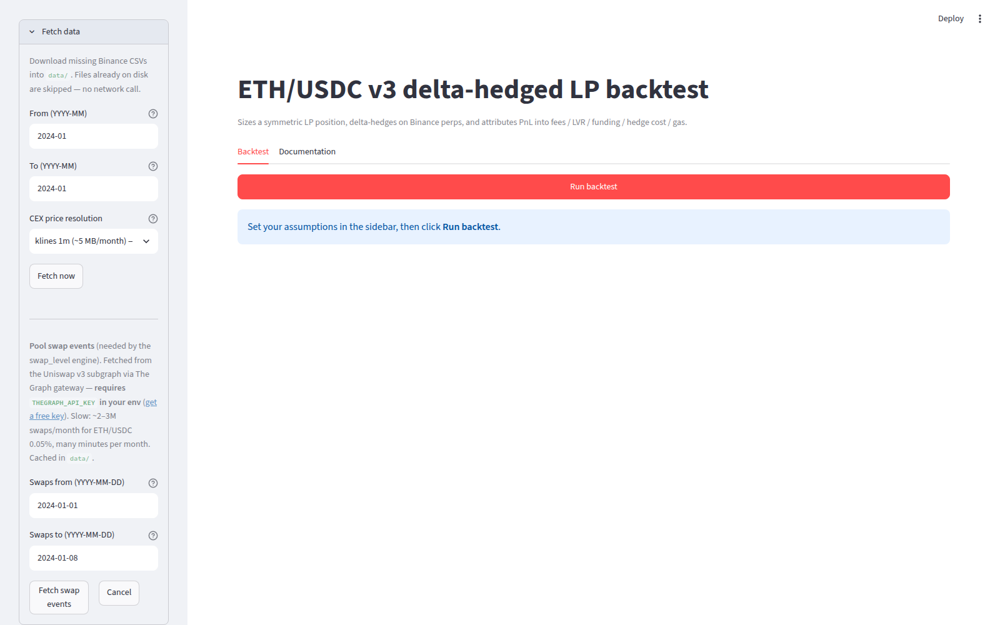

Binance files: set `From (YYYY-MM)` and `To (YYYY-MM)` to `2026-08`, leave `CEX price resolution` at `klines 1m (~5 MB/month) — recommended`, click `Fetch now`. The app calls `backtest.ensure_all_data` (app.py:246-252), which downloads `ETHUSDT-1m-2026-08.zip` and `ETHUSDT-fundingRate-2026-08.zip` from `data.binance.vision`, unzips them into `data/ETHUSDT-klines-1m-2026-08.csv` and `data/ETHUSDT-fundingRate-2026-08.csv`, and reports `Binance: 2 downloaded, 0 already present`. Files already on disk are skipped.

Swap events: set `Swaps from` and `Swaps to`, click `Fetch swap events`. This needs an API key for The Graph, a public indexing service for Ethereum, in the environment variable `THEGRAPH_API_KEY`; the app refuses without it (app.py:297-302). **On the deployed commit this button fails against the current index**: the query requests a field `liquidity` on each swap that the index no longer exposes, and the app shows `Type Swap has no field liquidity`. It also stores two columns as Python integers that overflow the file format on any real month. DATA.md section 3 documents both and the script used instead. The result of that script is `data/swaps_0x88e6a0_2026-08-01_2026-08-31.parquet`, which is the file name the sidebar would produce for those dates, and the app finds it.


`Real data (files)` detection: `Mode` set to `Real data (files)` makes three selectboxes appear. `Swaps file` lists every `*.parquet` or `*.csv` under `data/` or the repo root whose name contains "swap" (app.py:132-143). `CEX price file` lists `*aggTrades*.csv` then `*klines*.csv` under `data/` and pre-selects the first, so when an aggTrades file exists it wins. `Funding file` lists `(none — assume 0)` first and pre-selects it. The guide's runs use the 1-minute klines and the funding file:


### 0.5 Where every headline number appears

After `Run backtest` the main area shows, in order: a verdict banner with the net APR, engine name and day count; a caption with the capital base; five metric tiles (Net PnL, Fees APR, LVR APR, Funding APR, Hedge cost APR); four more (Fees / LVR, % time in range, Sharpe, Max drawdown); two download buttons; a `Cumulative PnL` chart; a `PnL attribution` section with `Cumulative` and `Daily bars` tabs; an `ETH price and LP delta` section with two charts; the optional rolling section; two expanders `Full summary` and `Timeseries (first 500 rows)`; the optional by-month and sweep sections; and the `Run comparison` section once two runs exist. Section 7 walks through each with the real numbers.

### 0.6 Exporting

`Download summary (JSON)` serves the summary dictionary (the 26 fields of section 7.4). `Download timeseries (CSV)` serves the 60-second grid frame, 44,640 rows for August with 11 columns (`price, lp_value, lp_delta, hedge_delta, fee_usd, lvr_usd, funding_usd, hedge_cost_usd, gas_usd, net_usd, cum_net`). In the browser sandbox used for this guide the downloads are inert; the same frames were written directly from Python into `docs/guide/raw/default/`.

### 0.7 The optional analyses

`Run range × hedge-band sweep` runs one backtest per cell of a grid (default 5 hedge bands × 6 range widths, 30 runs, 15.8 s on the August tape) and shows a heatmap plus a `Full sweep table` expander. `Rolling-window distribution (30d)` shows the net APR of each trailing 30-day window; with 31 days of data that is 2 windows. `Backtest by month` runs one backtest per calendar month; with one month of data it shows `Loaded data spans only 1 month — need at least 2`. The stress test lives in the same expander but only appears when the `hourly` engine is selected; it is a synthetic price shock applied to the last N days and is discussed in section 8.11.

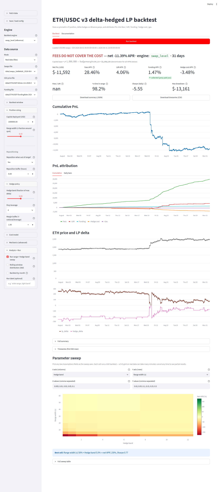

### 0.8 The engine from Python in five lines

```
import backtest as bt
swaps   = bt.load_swaps("data/swaps_0x88e6a0_2026-08-01_2026-08-31.parquet")
cex     = bt.load_cex_prices("data/ETHUSDT-klines-1m-2026-08.csv")
funding = bt.load_funding_series("data/ETHUSDT-fundingRate-2026-08.csv")
res     = bt.run_swap_level(bt.Assumptions(), swaps, cex, funding)   # res.summary, res.timeseries, res.attribution
```

`res.summary["net_usd"]` is −11592. Appendix C gives the command for every table in this guide.

---

## 1. The instruments, translated

### 1.1 A block

Ethereum is a shared ledger. Transactions are collected into batches called blocks, and a block is appended every 12 seconds by design. Every swap in the dataset carries the number of the block it was included in and that block's timestamp. In the August tape, 92,532 distinct blocks carried swaps, numbered 25,656,296 to 25,878,704. Between consecutive swap-bearing blocks the spacing per block has a median of 12.0 seconds, a mean of 12.044 and a 1st and 99th percentile both of 12.0. For the 47,661 pairs of adjacent block numbers, 99.65% are exactly 12 s apart and 167 are 24 s apart, which is one skipped slot (DATA.md section 5). So the tape ticks every 12 seconds, and a swap's timestamp is the block's, not the moment the trader sent it. Everything the pool does between two blocks is invisible; there is no intra-block price.

### 1.2 A token, a pool, a swap

A token is a balance on that ledger. USDC is a token redeemable one-for-one for a dollar; WETH is ether wrapped as a token. A pool is a smart contract, which is a program on the ledger that holds token balances and executes fixed rules. A swap is a transaction that sends one token to the pool and receives the other at the price the rules dictate. The dataset has one row per swap: block number, timestamp, the signed amount of each token (positive when the pool received it), the pool's price after the swap, and the pool's liquidity.

### 1.3 A perpetual future and funding

The hedge instrument is the Binance USD-M ETHUSDT perpetual. It is a linear future with no expiry, margined in USDT, that stays pinned to spot by a periodic cash transfer between longs and shorts called funding. Funding replaces the carry that an expiry would embed in the basis. Binance settles it every 8 hours, at 00:00, 08:00 and 16:00 UTC; the August file has 93 prints, all with `funding_interval_hours = 8`, 31 at each of those three times. The rate is a fraction of notional per settlement. A positive rate means longs pay shorts.

The real arithmetic from the first stamp: the file's first row is `calc_time 1785542400001` (2026-08-01 00:00:00.001 UTC), rate `0.00006744`. At that stamp the engine's hedge is short 249.2467 ETH at 1,862.68, notional 464,266.87 USD. The code computes `cash = -(hedge × price) × rate` (run_claude.py:656): −(−249.2467 × 1,862.68) × 0.00006744 = +31.31 USD, credited to the short, and the timeseries row for 00:00 carries `funding_usd = 31.31` (`raw/guide_derivations.txt`). Over the month the mean rate was +0.0000519 per 8 h, which annualises to 5.68% (0.0000519 × 3 × 365); 88 prints were positive and 5 negative; the sum of the 93 rates is +0.4828%, so a 1 USD short collected 0.48 cents. The engine collected 1,495 USD on the varying hedge. For an options trader: funding is the carry on the hedge, it was positive carry for the short in August, and it is small next to the gamma cost.

### 1.4 An AMM versus a limit order book

On an exchange a market maker quotes and can pull the quote. In a Uniswap pool the liquidity provider does not quote. The provider deposits two tokens and the contract commits them to a price schedule: the pool's price after a swap is a deterministic function of the reserves, and any taker who sees the exchange price move can trade against the pool at the stale price until the pool catches up. The provider is passively picked off, every block, by whoever arrives first. The pool charges every swap a fee (0.05% in this pool) that goes to the providers. The provider's business is therefore: sell the fee stream, pay the adverse selection.

### 1.5 A concentrated range as a short strangle

In Uniswap v3 a provider chooses a price band. Inside the band the position holds both tokens and its composition slides from all-USDC at the top of the band to all-ETH at the bottom. Outside the band it holds only one token and does nothing. The value function of the position against the ETH price is concave, flat outside the band, with kinks at the two bounds. Its delta falls as the price rises and rises as the price falls: short gamma. There is no premium; the fee stream is the premium, paid continuously and only while the price is inside the band. A ±15% range around 1,862.68 is a position that is short gamma between 1,583 and 2,143 and has no exposure at all beyond those two strikes. The hedge shorts the delta on the perp. What is left is the gamma bleed, called LVR below, against the fees.

### 1.6 A tick

The pool does not store a price; it stores a square root of price in fixed point, `sqrtPriceX96`, and an integer `tick` such that the price lies in `[1.0001^tick, 1.0001^(tick+1))`. Positions can only start and end on ticks that are multiples of the pool's tick spacing, 10 for this fee tier, so the band's bounds are quantised to 0.1% steps. The pool's price is in raw units, token1 per token0, which for this pool is WETH per USDC; the ETH price in dollars is `1e12 / P_raw` (run_claude.py:126-128), and a higher ETH price means a lower tick.

Verified on the first swap of the window (block 25,656,296, 2026-08-01 00:00:47): `sqrtPriceX96 = 1836535346318371944277253759023295`. `P_raw = (sqrtPriceX96 / 2^96)^2 = 5.373279e8`. `floor(ln(5.373279e8) / ln(1.0001)) = 201031`, and the stored `tick` is 201031. The ETH price is `1e12 / 5.373279e8 = 1,861.06` USDC per ETH; Binance's 1-minute close for that minute was 1,862.68. The same check holds on four other swaps spread across the month and on all 721 rows of the hourly pool file (DATA.md section 6, SOURCES.md 3a).

### 1.7 LVR versus impermanent loss

Impermanent loss is the difference between the value of the position and the value of having held the two tokens, evaluated at the exit price. It depends on where the price ends and not on the path. Loss-versus-rebalancing (Milionis, Moallemi, Roughgarden and Zhang, arXiv:2208.06046) is the running cost of the position against a continuously rebalancing portfolio at the exchange price. It accrues along the path at rate ½σ²P²|V''(P)| and it is exactly what a delta-hedged provider pays: the hedge removes the price exposure and leaves the gamma bleed. This guide measures LVR three ways on real data (section 6) and never uses impermanent loss; the app does not compute it either.

---

## 2. The data

Window: 2026-08-01 00:00:00 to 2026-08-31 23:59:59 UTC, 31 days. Pool: `0x88e6a0c2ddd26feeb64f039a2c41296fcb3f5640`, Uniswap v3 ETH/USDC 0.05%, Ethereum mainnet. Hedge: Binance USD-M ETHUSDT perpetual.

| Series | Source | File | Rows | Check |
|---|---|---|---|---|
| Swap events | The Graph gateway, Uniswap v3 subgraph `5zvR82Qo…`, fetched with the stock pagination and repaired (DATA.md 3-4) | `data/swaps_0x88e6a0_2026-08-01_2026-08-31.parquet` | 159,990 | sha256 `3e28bbf3…` |
| Pool hourly aggregates | same subgraph, `poolHourDatas` | `data/pool_hourly_0x88e6a0_2026-08-01_2026-09-01.parquet` | 745 | |
| Exchange price, 1 minute | `data.binance.vision` monthly klines | `data/ETHUSDT-klines-1m-2026-08.csv` | 44,640 | no missing minutes |
| Exchange price, every trade | `data.binance.vision` monthly aggTrades | `data/ETHUSDT-aggTrades-2026-08.csv` | 33,010,405 | 2.19 GB |
| Funding | `data.binance.vision` monthly fundingRate | `data/ETHUSDT-fundingRate-2026-08.csv` | 93 | 8 h, 00/08/16 UTC |

The checks (DATA.md section 5), in the order a sceptic would ask:

- **Is the swap file complete?** Summing `|amount0|` over the swaps gives 2,422,599,886 USD of volume for the month; the pool's own hourly `volumeUSD` sums to 2,422,385,371. Ratio 1.00009. Per hour the ratio has median 1.00006, 1st percentile 0.99869, 99th 1.00129, and no hour is outside [0.9, 1.1]. The stock code's pagination dropped 192 rows (0.12%) at page boundaries, which were recovered by re-querying each boundary second.
- **Does the pool trade at the exchange price?** Basis of the pool price after each swap against the Binance 1-minute close: mean −0.65 bps, median −0.54, standard deviation 11.1 bps, 1st percentile −24.9, 99th +19.6 over all 159,990 swaps. Taking the last swap of each minute (38,092 minutes): mean −0.93 bps, standard deviation 5.2, 97.3% within 10 bps. The pool quotes USDC, the perp quotes USDT; the two dollars traded at par.
- **Is the chain clock what it should be?** Section 1.1: 12 seconds, 99.65% exact.
- **Is funding what it should be?** Section 1.3: 93 prints, 8 h, +5.68% annualised mean.

Deviations from the stock code, both forced by the live index: `liquidity` is not available per swap and was filled from the pool's hourly liquidity of the containing hour, so the position's fee share is computed against hourly rather than per-swap pool depth; and the stock writer overflows on real amounts, so amounts are stored as floats, which is what the engine converts them to on load anyway (DATA.md section 3).

### 2.1 Tape statistics and what they mean for a short-gamma book

From the 44,639 one-minute log returns:

| Statistic | Value |
|---|---|
| Month open / close | 1,861.68 / 2,466.53 (+32.49%) |
| High / low | 2,566.40 (Aug 27 09:27) / 1,820.61 (Aug 1 18:50) |
| Realised annualised vol, 1-minute returns | 51.77% |
| Realised annualised vol, daily returns (30) | 67.82% |
| Largest absolute 1-minute move | +3.4753% at 2026-08-19 15:27 (2,046.42 to 2,118.79 in one minute) |
| Excess kurtosis / skew | 264.59 / +2.43 |
| Minutes with a move over 0.5% / over 1% | 56 / 12 |
| Lag-1 autocorrelation, absolute returns / signed returns | 0.431 / −0.010 |

For a short-gamma position: the drift does not matter after hedging, the realised variance does, and August's was 52% at the hedge frequency and 68% at daily frequency. Daily vol above minute vol says the month trended; the position paid gamma bleed at 52% and then paid a second time at the band, because the price left the ±15% range on Aug 19 and the position was re-struck. The 3.48% minute is a 48.7-standard-deviation move at the one-minute scale (per-minute standard deviation 0.071% at 52% vol) and 1.3 daily standard deviations; the hedge grid is 60 s, so the hedge could not trade inside it. Kurtosis of 265 says the tape is nothing like the diffusion the closed-form LVR assumes, and yet the closed form and the path-exact loss agree to 2% over the month (section 6), because the integral is dominated by the many small moves.

### 2.2 Demo mode

The app's default data source is `Demo (synthetic tape)`. It generates a geometric Brownian price path and a simulated stream of swaps from an arbitrageur plus Poisson noise flow (run_claude.py:363-455) and runs the same engine on it. It shows a yellow banner `Synthetic tape — numbers do NOT reflect real ETH/USDC PnL`. It exists to exercise the code. This guide does not use it; the only place its numbers appear is the engine self-test in ENVIRONMENT.md.

---

## 3. The position at t0

`build_position` (run_claude.py:211-234) takes the first price on the 60-second hedge grid, 1,862.68 (the Binance close of the first minute), the ±15% width and the capital, and returns (`raw/default/diag.json`, `position_t0`):

| Item | Value |
|---|---|
| Entry price | 1,862.68 |
| Lower bound / upper bound in ETH price | 1,582.93 / 2,143.12 |
| Ticks (pool frame; low tick is the high ETH price) | 199,620 / 202,650 |
| Liquidity L, raw on-chain units | 1.588442e17 |
| USDC leg | 535,733.13 |
| ETH leg | 249.2467 ETH = 464,266.87 USD |
| Position value | 1,000,000.00 |
| Delta (ETH held) | 249.2467 ETH |
| Maximum delta (all ETH, at the lower bound) | 561.2421 ETH |
| Hedge at t0 | short 249.2467 ETH, notional 464,266.87 USD |
| Rehedge band (3% of max delta) | 16.84 ETH |

The bounds are not exactly ±15% because they are rounded outward to tick multiples of 10 (run_claude.py:223-228): 1,862.68 × 0.85 = 1,583.28 becomes 1,582.93 and × 1.15 = 2,142.08 becomes 2,143.12.

**Why the composition is 53.6% USDC and 46.4% ETH despite a symmetric band.** Write `L_h` for the liquidity in human units (`L × 1e6 / 1e18`, 158,844.24 here). The two legs are (SOURCES.md 3d, 4a):

```
USDC = L_h × (√P − √P_lo)
ETH  = L_h × (1/√P − 1/√P_hi)
```

At P = 1,862.68: √P = 43.1588, √P_lo = 39.7861, √P_hi = 46.2939. The USDC leg is 158,844.24 × 3.3727 = 535,733.13. The ETH leg is 158,844.24 × (1/43.1588 − 1/46.2939) = 249.2467 ETH, worth 464,266.87 (`raw/guide_derivations.txt`). The band is symmetric in price but the position lives in the square root of price, which is concave: √P − √P_lo = 3.3727 is larger than √P_hi − √P = 3.1351. More of the liquidity's "distance" sits below spot than above, so more of the value sits in the USDC leg. The delta at entry, 249.25 ETH, is 44.4% of the maximum 561.24, not 50%, for the same reason.

The value of L is set so that the position is worth exactly the capital at the entry price: `L = capital / value(L = 1)` (run_claude.py:232-234). A narrower band gives a larger L for the same capital, which is the lever behind the range sweep in section 8.

---

## 4. What the engine does, step by step

`run_claude.run_backtest` (run_claude.py:674-781), in execution order, with the number each stage produced on the default run.

**Ingest and clip.** `load_swaps` maps the parquet onto the canonical columns and casts amounts to float (run_claude.py:253-273): 159,990 rows. `load_cex_prices` takes the 1-minute `close` stamped at `close_time`, resamples to 1 second and forward-fills (295-315): 2,678,341 seconds from 2026-08-01 00:00:59 to 2026-08-31 23:59:59. `load_funding` (318-324): 93 prints. With an empty `Backtest window` nothing is clipped. The app's loaders are the same functions behind a cache (app.py:158-175).

**The hedge grid.** The 1-second series is resampled to `grid_seconds` = 60 with the last price in each bucket (548, 596): 44,640 rows from 00:00 on Aug 1 to 23:59 on Aug 31. Every decision, mark and aggregation below happens on this grid. With 1-minute klines the price changes once per grid row; a 10 s grid would see the same 44,640 distinct prices (SCENARIOS.md section 5).

**Position build and schedule.** `build_position_schedule` (543-580) builds the section 3 position at the first grid price, then walks the grid: whenever the price has been outside the band for at least `reposition_buffer_hours` = 6, it values the position at that price, deducts 5 bps and 40 USD, and builds a new ±15% position with the remainder. On August's tape that happened once, at 2026-08-20 02:50, at 2,251.02: value at exit 1,033,724.78, minus 516.86 and 40, new capital 1,033,167.92, new band 1,912.23 to 2,588.96, new L 1.4929e17.

**Per-swap fee attribution and the liquidity share.** `attribute_swaps` (458-535) assigns each swap to the position in force, marks it against the exchange price at `block_time + markout_seconds` (491-496), and tests whether the swap's `tick` is inside the position's band (502-504): 157,051 of 159,989 swaps (98.16%) were. For in-range swaps the share is `L_you / (L_active + L_you)` (505-506): mean 2.655%, min 0.33%, max 4.13% as the pool's own liquidity moved between 1.85e18 and 4.51e19 during the month. The fee on each swap is `fee_tier` × the gross input token, converted to USD at the mark if the input was ETH (511-513), times the share. The pool as a whole earned 1,167,990 USD of fees on 2,335,160,984 USD of in-range volume at 5 bps; the position's share was 28,955.80 USD, which is 2.48% of the pool's fees.

**LVR on the fee-net execution price.** For the same swap the taker's execution price is formed from the amounts after the fee has been stripped from the input leg (517-522); the taker's profit is `± eth_qty × (p_cex − p_exec)` with the sign set by which way the ETH went (523-525), and the position's LVR is its share of that (526). The fee is stripped first because it is already booked as `fee_usd`; measuring the taker's edge on the gross amount would charge the fee twice. The gross markout, fee-inclusive, is kept as `markout_usd` (528-533) and the identity `fee_usd − lvr_usd = markout_usd` holds on every row: 28,955.80 − (−4,134.05) = 33,089.85. Section 6 explains why `lvr_usd` came out negative on the 1-minute mark and what it is on a fresh mark.

**The hedge loop.** `simulate_hedge` (588-668) computes the position's delta on every grid row from L and the band, `lp_delta = L × (√P_clipped − √P_lo)` in the pool frame (607), sets the initial hedge to minus that delta before the loop (614), then on each row trades only when the residual `lp_delta + hedge` exceeds the band, 3% of max delta = 16.84 ETH (615-619). Result: 150 trades in 31 days, the first at 2026-08-01 18:30 for −18.40 ETH, total turnover 2,845.55 ETH = 6,355,283 USD, mean clip 18.97 ETH = 42,369 USD. The largest clip was 441,856 USD: the re-hedge at the reposition, when the delta jumped from 0 (all USDC above the old band) to 212.54 ETH inside the new one. The initial hedge is not counted as a trade and is not charged.

**Execution cost and the quadratic impact term.** Each trade costs `notional × (half_spread + taker) / 1e4 + notional × (notional / 1e5) × impact / 1e4` (623-625). With 0.5 + 4.5 bps and 0.8 bps per 100k: the linear part summed to 3,177.64 USD, the quadratic part to 362.02, total 3,539.66. The quadratic term equals the linear one when a clip reaches 5 / 0.8 × 100,000 = 625,000 USD. At the mean clip of 42,369 the impact is 1.44 USD against 21.18 of spread and fee; at the 441,856 clip it is 156 against 221. Impact only bites at 3M and above in the capital sweep (section 8.7).

**Hedge mark-to-market.** `hedge_pnl = hedge[t−1] × (p[t] − p[t−1])` (630-631): −101,437.47 USD over the month for a short in a rising market. The LP's inventory, marked by the same value function at the grid price (664-668), gained 63,474.93 including the 556.86 write-down at the reposition. Hedged inventory: −37,962.54.

**Funding accrual.** Each of the 93 stamps is placed on the grid row at or before it and `cash = −(hedge × price) × rate` is added there (645-660): +1,494.55 USD.

**Reposition trigger, buffer and gas.** Back in `run_backtest`, for each reposition after the first position, the grid row at that time gets `gas_usd += 40 + capital_usd × 5 bps` = 540 (690-695). The schedule already wrote the capital down by 556.86 at the same moment, and that write-down flows into `lp_pnl_usd`; `net_usd` then subtracts `gas_usd` as well (706). One reposition costs 556.86 in fact and 1,096.86 in `net_usd` (SCENARIOS.md section 9). Note also that `gas_usd` uses the initial capital, not the current one.

**The summary.** `net_usd = lp_pnl + hedge_pnl + fee + funding − hedge_cost − gas` on every row (699-707), summed: 63,474.93 − 101,437.47 + 28,955.80 + 1,494.55 − 3,539.66 − 540 = −11,591.86, rounded to −11,592. `decomp_usd = fee − lvr + funding − hedge_cost − gas` (709-715): 30,504.73. Capital base = 1,000,000 + margin, margin = `max_notional / leverage × margin_buffer` = 528,320.22 / 4 × 1.5 = 198,120 (719-722). APRs divide by the base and by 31/365 (729-731). Sharpe is the daily net P&L mean over its standard deviation times √365 (760-767): −5.55. Max drawdown is the worst peak-to-trough of cumulative net (759, 769): −13,161. The 26 fields are in section 7.4.

---

## 5. P&L term by term

Default run, 31 days, capital base 1,198,120 USD.

| Term | USD | APR | What it is to an options trader |
|---|---|---|---|
| Fees | +28,956 | +28.46% | The premium stream. Paid per swap while in range, proportional to the position's share of pool liquidity. |
| Hedged inventory (LP value + perp mark) | −37,963 | | The gamma bleed of a short strangle rehedged every minute. This is LVR measured path-exact. |
| Funding | +1,495 | +1.47% | Carry on the hedge. Positive: the short collected. |
| Hedge execution | −3,540 | −3.48% | Slippage on 150 rehedges: spread plus fee plus impact. |
| Gas and re-ratio | −540 | | Transaction cost of re-striking the position once, counted a second time (section 4). |
| **Net** | **−11,592** | **−11.39%** | |

**Fees.** `fee_usd = share × fee_tier × gross input` per swap. Worked example: a taker sends 100,000 USDC into the pool while the position holds 2.655% of in-range liquidity: fee = 100,000 × 0.0005 × 0.02655 = 1.33 USD. Over 157,051 in-range swaps and 2,335,160,984 USD of volume the sum is 28,955.80. Per day, 934 USD on average, 511 in the calmest week and 1,536 in the busiest (SCENARIOS.md section 10).

**LVR.** Path-exact: 37,962.54 USD, from the hedged inventory. Closed form, `Σ ½ σ²_step P² |V''(P)|` over the grid with σ²_step the variance of 60-second log returns (5.0988e-7, which annualises to 51.77%): 37,263 USD. Per-swap with a fresh mark (aggTrades tape): 34,360. The three agree to within 10%. What a trader should read: the position was short roughly 38,000 USD of gamma over the month on 1,000,000 of capital, 3.8% a month, against 2.9% of fees.

**Funding.** Section 1.3. 93 stamps, 1,494.55 USD; the largest single stamp +47.95 USD at 2026-08-20 08:00 and the smallest −4.18 USD at 2026-08-03 08:00 (`raw/guide_derivations.txt`).

**Hedge execution.** 150 trades, 6,355,283 USD of turnover, 5 bps linear plus the impact term: 3,539.66 USD, 5.57 bps of turnover. Turnover per day 91.8 ETH against a position of 249 to 287 ETH: the book turned over roughly a third of its delta every day.

**Gas.** One reposition: 40 USD of gas and 5 bps of capital to swap the tokens back to the new ratio; 540 booked, plus the 556.86 write-down already inside the inventory term.

**The hedge band and rehedge frequency.** The band is 3% of the position's maximum delta, 16.84 ETH, a fixed dead zone in ETH, not in dollars or in delta-fraction. In an options book this is rehedging when the residual delta exceeds a fixed number of contracts. Tightening it to 0.5% (2.8 ETH) gave 3,218 trades and 13,390 USD of execution cost; widening it to 10% (56 ETH) gave 15 trades, 1,492 USD, and a worse drawdown (SCENARIOS.md section 4). The gamma cost itself does not move with the band on this tape by more than 4,000 USD across the grid; the execution cost moves by 12,000. August rewarded the widest band tested.

---

## 6. The two reconciliation controls

**Control 1: path-exact `net_usd` against attribution `decomp_usd`.** The engine reports both. `net_usd` is what the book made: inventory marked at the exchange price, plus the perp, plus fees, funding and costs. `decomp_usd` replaces the inventory and the perp with `−lvr_usd`, the per-swap measure. If the per-swap measure is right, the two agree up to the discrete-hedge error, which is the residual delta between rehedges times the price moves. The engine reports the gap as `discrete_hedge_error_usd`.

On the default run the gap is −42,097 USD on a net of −11,592. That is not hedge error. Per-swap LVR came out at −4,134 (a gain) while the hedged inventory lost 37,963. The cause is the mark. The 1-minute kline close is stamped at the end of its minute and forward-filled, so a swap at second 17 is marked against a price up to 59 seconds old. Arbitrage swaps move the pool to the new exchange price; against the old one they look like taker losses. Three runs replace the stale mark (SCENARIOS.md section 1):

| Mark | `lvr_usd` | gap `net − decomp` |
|---|---|---|
| 1-minute close, forward-filled, markout 0 (default) | −4,134 | −42,097 |
| same tape, markout 60 s | +36,655 | −1,307 |
| same tape, markout 300 s | +35,024 | −2,939 |
| aggTrades resampled to 1 s, markout 0 | +34,360 | −3,602 |

With a fresh mark the gap collapses to 1,300 to 3,600 USD, which is the discrete-hedge error proper: 0.1% to 0.3% of capital over a month at a 60-second, 16.8-ETH band. The app's default file pick when an aggTrades file is present is the aggTrades file, so a user who downloads it gets the fresh mark; a user who follows the sidebar's own recommendation (`klines 1m — recommended`) gets the stale one and an `LVR APR` tile of +4.06% with `Fees / LVR` reading `nan`.


**Control 2: path LVR against the closed form.** `_closed_form_lvr` (run_claude.py:785-800) computes `Σ ½ × var_step × P² × |dΔ/dP|` over the grid, with `var_step` the sample variance of the 60-second log returns of the grid price over the whole window and `dΔ/dP` a finite difference of the position's delta against price. The σ is therefore the realised 1-minute vol of the perp over August, 51.77% annualised, held constant, not an implied vol and not a local estimate. It gives 37,263 USD against the path-exact 37,963: a 1.8% gap. The closed form assumes a diffusion; the tape has kurtosis 265 and a 3.5% minute. The agreement says the gamma bleed of this position over this month is explained by the realised variance at the hedge frequency, and that the position's gamma profile in the code is the right one (SOURCES.md 1c verifies `|V''| = L_h / (2 P^1.5)` inside the band against the finite difference to 1e-6).

Why a trader should care that both gaps exist. The first gap is a data-quality alarm: when it is large, the attribution tiles are wrong even though the headline is right, and the sign of `LVR APR` flips. The second gap is a model check: if the closed form and the path disagreed by a factor, either σ or the value function would be wrong, and every sweep in section 8 would be uninterpretable. On August's data the first alarm fires on the recommended file and the second check passes.

---

## 7. The default run, screen by screen

Local app, `swap_level`, `Real data (files)`, swaps parquet, 1-minute klines, funding file, every other control at its default. The same run through the test harness (`raw/apptest/default_ui_metrics.json`) and through Python (`raw/default/summary.json`) gives the same 26 fields (SCENARIOS.md section 1).

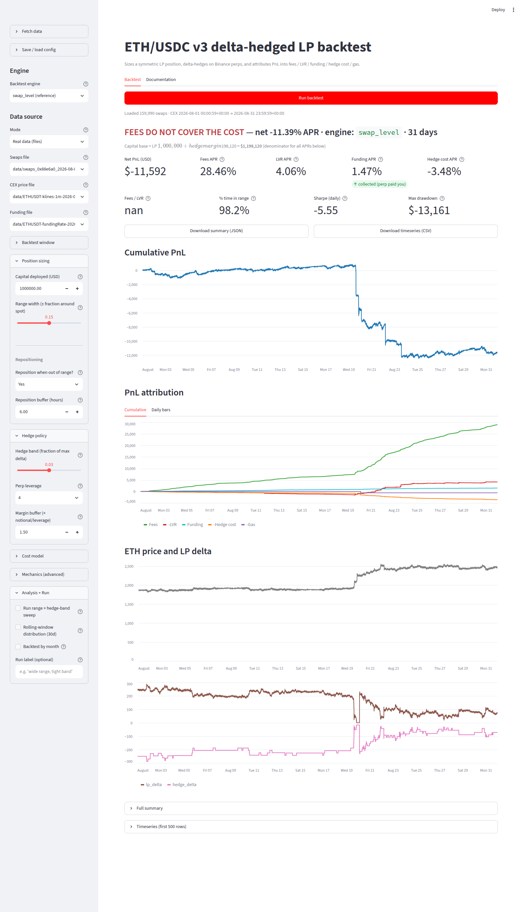


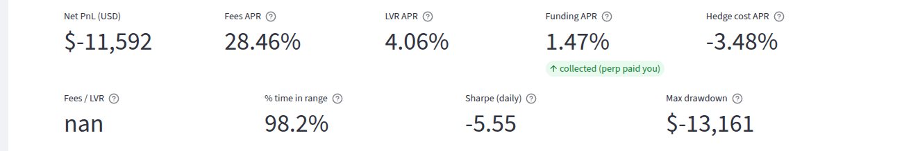

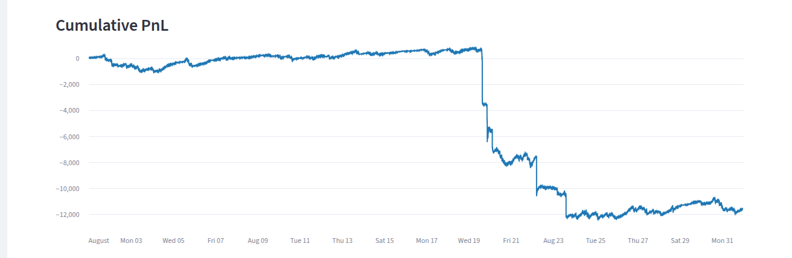

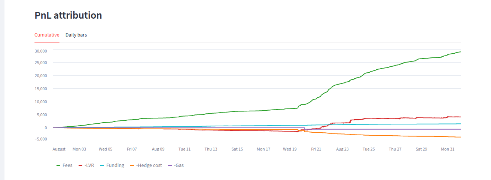

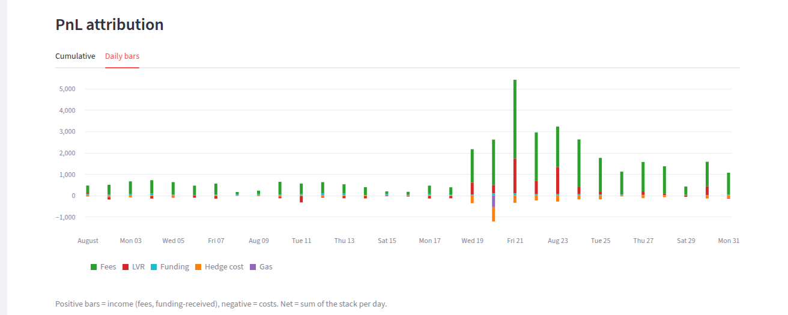

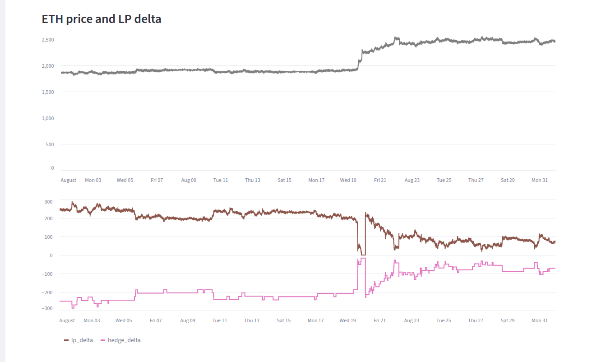

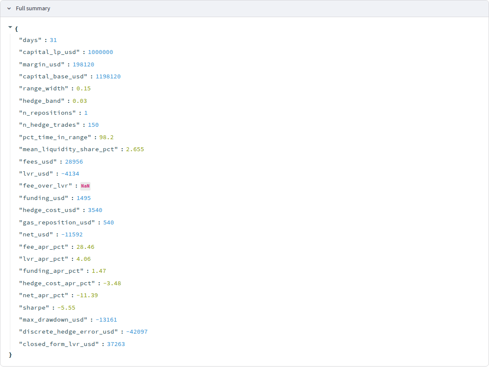

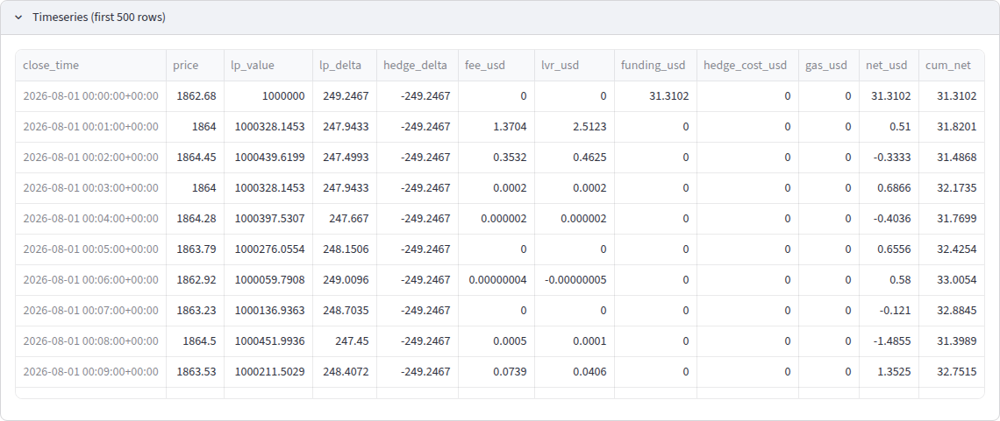

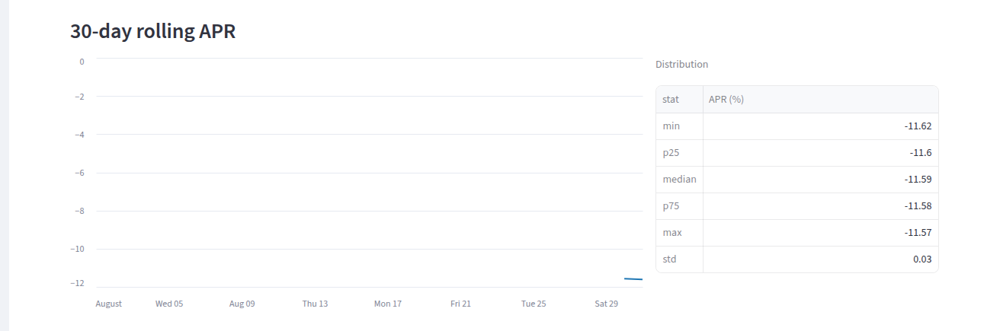

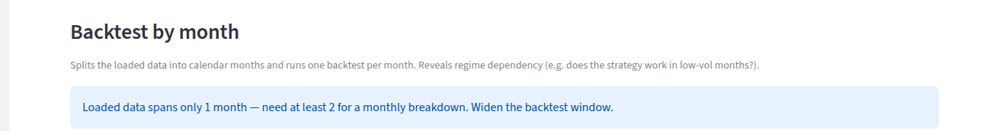

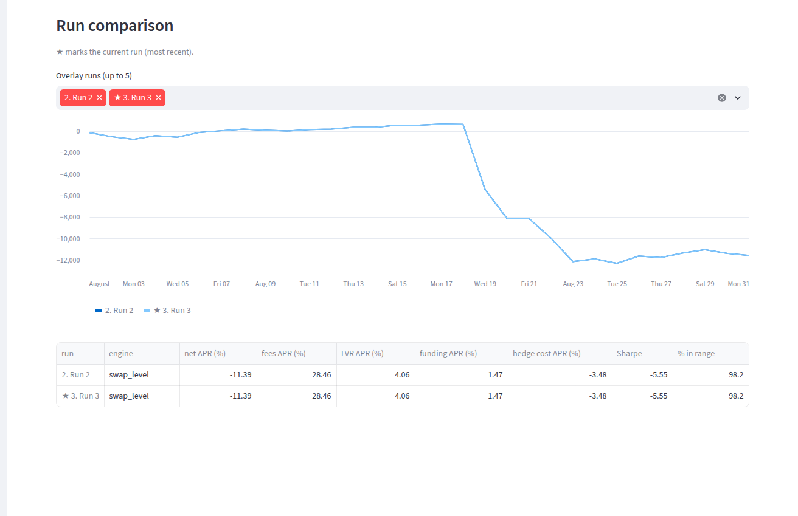


### 7.1 Verdict banner and capital base

`FEES DO NOT COVER THE COST — net -11.39% APR · engine: swap_level · 31 days`. Red because `net_apr_pct` ≤ 0 (app.py:1263-1268). The day count is `(last grid row − first) / 86400` = 31.0. Below it: `Capital base = LP $1,000,000 + hedge margin $198,120 = $1,198,120 (denominator for all APRs below)`. On screen the words "hedge margin" render in an italic serif face because the app's Markdown treats the two dollar signs in that caption as a LaTeX span (app.py:1281-1284); the numbers are unaffected. The margin is the peak perp notional over the month, 528,320 USD when the short reached 286.9 ETH at 18:46 UTC on Aug 1, near the month's low, divided by 4x leverage and multiplied by the 1.5 buffer. If the window were under 30 days the banner would read `INSUFFICIENT WINDOW` in orange instead (app.py:1259-1262), which is what every weekly run in section 8.10 shows.

### 7.2 The nine tiles

| Tile | Shown | How computed | Read it as |
|---|---|---|---|
| Net PnL (USD) | $-11,592 | sum of `net_usd` over 44,640 grid rows | the book's P&L |
| Fees APR | 28.46% | 28,956 / 1,198,120 / (31/365) | premium income on the whole capital base including margin |
| LVR APR | 4.06% | −(−4,134) / base / yrs | wrong sign on this file (section 6); −33.8% to −36.0% on a fresh mark (the app shows LVR APR negative when LVR is a loss) |
| Funding APR | 1.47%, "collected (perp paid you)" | 1,495 / base / yrs | carry on the short |
| Hedge cost APR | −3.48% | −3,540 / base / yrs | execution |
| Fees / LVR | nan | `fees / lvr` only when lvr > 0 (run_claude.py:750) | undefined on this file; 0.84 on the aggTrades mark (28,947 / 34,360) |
| % time in range | 98.2% | share of swaps whose tick was inside the band (747-749), not a share of time | the position was live for 98% of the flow |
| Sharpe (daily) | −5.55 | mean / std of the 31 daily net sums × √365 | a consistent daily loss, not a volatile one |
| Max drawdown | $-13,161 | min of `cum_net − cummax(cum_net)` | the loss was monotone: drawdown ≈ total loss |

### 7.3 The charts

`Cumulative PnL` plots `cum_net`. It is flat to slightly positive for the first two weeks, then falls from Aug 19. `PnL attribution`, `Cumulative` tab, plots the running sums of fees, −LVR, funding, −hedge cost and −gas; on the stale mark the −LVR line rises, which is the sign problem of section 6 made visible. `Daily bars` shows the same five terms per day. `ETH price and LP delta` plots the grid price and then `lp_delta` against `hedge_delta`; the two mirror each other with a 16.8-ETH dead zone, drop to zero together when the price leaves the band on Aug 19, and jump back at the reposition on Aug 20.

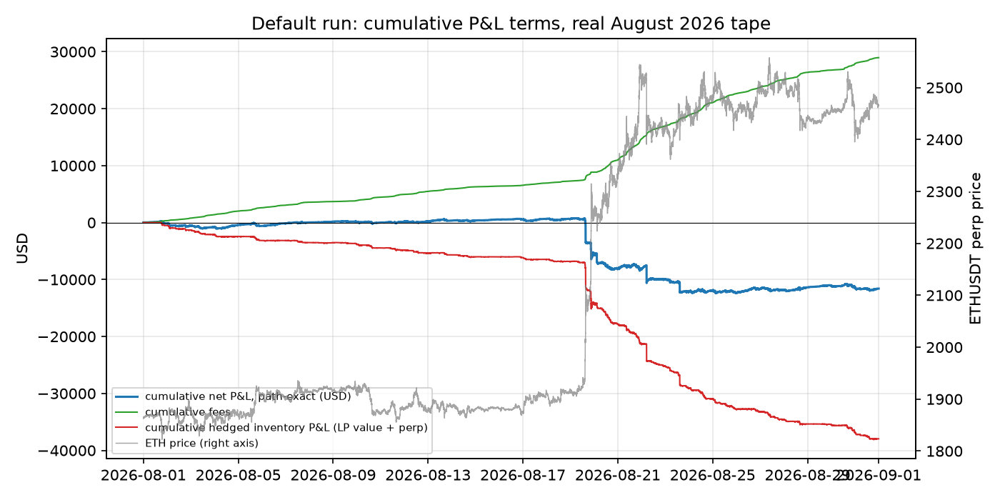

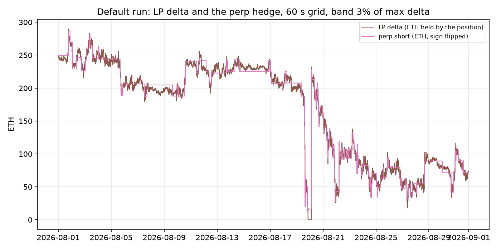

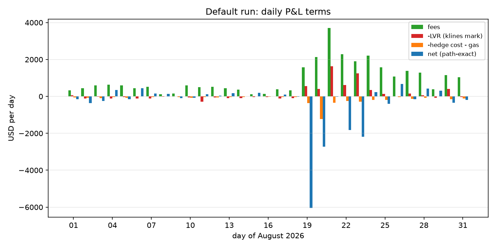

### 7.4 Full summary

The `Full summary` expander shows the 26 fields:

| Field | Value | Field | Value |
|---|---|---|---|
| days | 31.0 | fees_usd | 28956 |
| capital_lp_usd | 1000000.0 | lvr_usd | −4134 |
| margin_usd | 198120 | fee_over_lvr | NaN |
| capital_base_usd | 1198120 | funding_usd | 1495 |
| range_width | 0.15 | hedge_cost_usd | 3540 |
| hedge_band | 0.03 | gas_reposition_usd | 540 |
| n_repositions | 1 | net_usd | −11592 |
| n_hedge_trades | 150 | fee_apr_pct | 28.46 |
| pct_time_in_range | 98.2 | lvr_apr_pct | 4.06 |
| mean_liquidity_share_pct | 2.655 | funding_apr_pct | 1.47 |
| sharpe | −5.55 | hedge_cost_apr_pct | −3.48 |
| max_drawdown_usd | −13161 | net_apr_pct | −11.39 |
| discrete_hedge_error_usd | −42097 | closed_form_lvr_usd | 37263 |

`Timeseries (first 500 rows)` shows the first 500 grid rows of the 11-column frame; row 0 is 2026-08-01 00:00 with price 1862.68, `lp_value` 1,000,000, `lp_delta` 249.25, `hedge_delta` −249.25, `funding_usd` 31.31.

### 7.5 Rolling, by-month, sweep, comparison

`30-day rolling APR` on 31 days of data has two windows: min −11.62%, median −11.59%, max −11.57%, std 0.03. `Backtest by month` shows `Loaded data spans only 1 month — need at least 2 for a monthly breakdown`. The sweep and the comparison are in section 8.12 and section 0.7.

---

## 8. Scenarios

Every table below is in SCENARIOS.md with its raw directory; the verdict line says whether the result is a property of the strategy or of the 31 days.

### 8.1 The default and its two file-pick variants

| Run | net | net APR | fees | LVR (as reported) |
|---|---|---|---|---|
| 1m klines + funding (this guide's default) | −11,592 | −11.39% | 28,956 | −4,134 |
| aggTrades + funding (the app's default file pick) | −11,601 | −11.40% | 28,947 | +34,360 |
| 1m klines, no funding (the app's default funding pick) | −13,086 | −12.86% | 28,956 | −4,134 |

Verdict: the headline is robust to the price file; the attribution is not. Property of the data pipeline.

### 8.2 The hourly engine on the same window

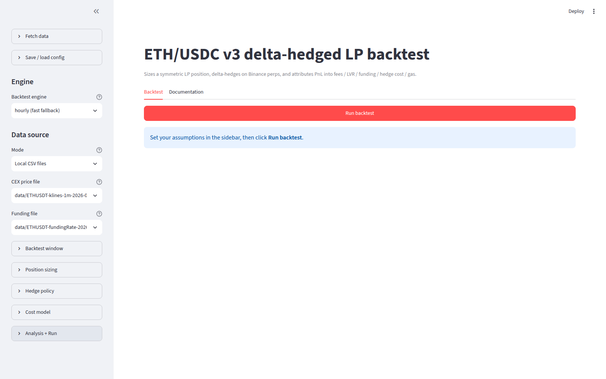


The `hourly (fast fallback)` engine in `Local CSV files` mode reports net +69,274 USD (+84.34% APR) with fees 0. Fees are zero because the mode sets the volume to zero before calling the engine (app.py:1137-1138). The net is positive because the engine's realised hedge P&L carries the wrong sign: a short bought back above its average price is booked as a gain (kimi/uniswap_delta_hedge_backtest.py:393). On the first reducing trade it books −92.03 USD where +92.03 is correct; over a month in which ETH rose 32% it books +106,112 on a short where the correct figure is −45,646 (`raw/hourly_hedge_sign_check.txt`). With the correct hedge P&L the same run is −82,485 USD. The engine's `pool_share` default of 0.001 is 27× below the measured 0.02655 for this position; its `pool_volume_multiplier` default of 0.08 is 7.8× above the measured pool-to-Binance volume ratio of 0.01023. Its `PnL attribution` charts also show the hedge cost 319× too large because of a cumulative-versus-per-bar mix-up in the columns (SCENARIOS.md section 2). Verdict: do not use this engine for a number. Property of the code.

### 8.3 Range width

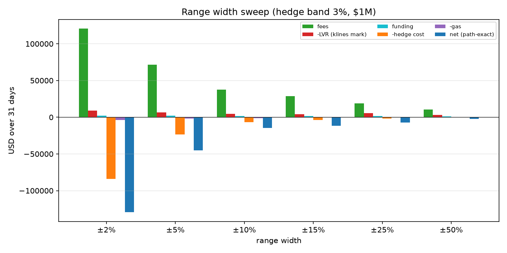

| range | fees | hedge cost | trades | repositions | in range | net | net APR | closed-form LVR |
|---|---|---|---|---|---|---|---|---|
| ±2% | 120,556 | 84,110 | 3,549 | 7 | 82.3% | −129,455 | −110.75% | 240,399 |
| ±5% | 71,555 | 23,542 | 1,075 | 3 | 93.2% | −45,228 | −38.76% | 105,348 |
| ±10% | 37,330 | 6,713 | 292 | 2 | 90.1% | −14,513 | −13.53% | 59,048 |
| ±15% | 28,956 | 3,540 | 150 | 1 | 98.2% | −11,592 | −11.39% | 37,263 |
| ±25% | 18,730 | 1,800 | 68 | 1 | 98.3% | −7,275 | −7.28% | 22,578 |
| ±50% | 10,262 | 342 | 13 | 0 | 100.0% | −2,436 | −2.49% | 11,779 |

Narrowing the band multiplies L for the same capital, so fees rise 4.2× from ±15% to ±2%, the gamma cost rises 6.5× and the hedge turnover 24×, with 7 re-strikes. Every width loses. Verdict: the ordering is the strategy (concentration raises fee and gamma together, and the gamma won at 52% realised vol); the size of the loss is the data (a trending month with a re-strike at the band).

### 8.4 Hedge band

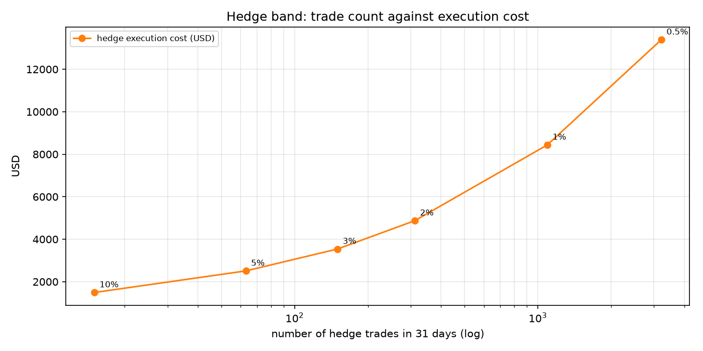

| band | trades | hedge cost | net | net APR | max drawdown |
|---|---|---|---|---|---|
| 0.5% | 3,218 | 13,390 | −21,367 | −21.02% | −21,487 |
| 1% | 1,094 | 8,439 | −16,633 | −16.34% | −16,768 |
| 2% | 312 | 4,873 | −12,670 | −12.50% | −13,322 |
| 3% | 150 | 3,540 | −11,592 | −11.39% | −13,161 |
| 5% | 63 | 2,509 | −11,299 | −11.14% | −13,278 |
| 10% | 15 | 1,492 | −9,327 | −9.27% | −17,026 |

Fees, LVR and gas are identical in every row; only the hedge loop changes. Verdict: the shape (execution cost falls with the band, unhedged gamma rises) is the strategy; the location of the optimum is the data.

### 8.5 Hedge grid

| grid | trades | net | net APR | closed-form LVR |
|---|---|---|---|---|
| 10 s | 150 | −11,623 | −11.42% | 0 |
| 30 s | 150 | −11,623 | −11.42% | 0 |
| 60 s | 150 | −11,592 | −11.39% | 37,263 |
| 120 s | 135 | −9,792 | −9.64% | 38,742 |
| 300 s | 129 | −7,910 | −7.76% | 36,852 |

10 s and 30 s equal each other and 60 s to within 31 USD because the price file only changes once a minute. The closed form reads 0 at 10 s and 30 s because the finite-difference gamma is NaN wherever the price repeats and the sum skips NaN (run_claude.py:788-790). Verdict: a property of the data resolution, not of the strategy.

### 8.6 Fee tier

| fee tier | fees | LVR (stale mark) | net | net APR |
|---|---|---|---|---|
| 0.01% | 5,791 | −27,299 | −34,756 | −34.16% |
| 0.05% | 28,956 | −4,134 | −11,592 | −11.39% |
| 0.30% | 173,735 | 140,645 | +133,187 | +130.89% |
| 1.00% | 579,116 | 546,026 | +538,568 | +529.27% |

Not economically coherent: the flow in the tape is the flow that chose a 0.05% pool. At 1.00% the engine charges 579,116 USD of fees on 2.34 billion USD of volume that would not have routed through a 1% pool, and imputes a fee-net execution price 95 bps from the one the taker paid, so its LVR jumps to 546,026 and the net-versus-decomposition gap to 508,064. `fee − lvr` stays at 33,090 in every row because that is the taker's markout against the price actually paid. Verdict: the only coherent row is the pool's own tier.

### 8.7 Capital: does it scale

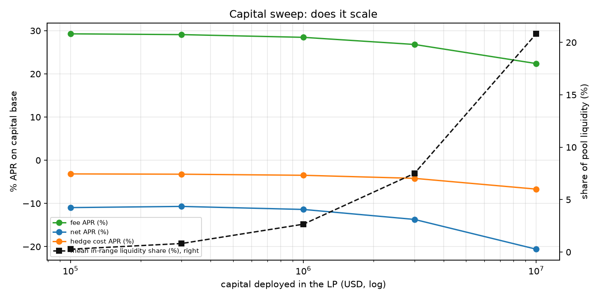

| capital | share of pool | fees | fee APR | hedge cost (of which impact) | net | net APR |
|---|---|---|---|---|---|---|
| 100k | 0.273% | 2,978 | 29.27% | 321 | −1,115 | −10.96% |
| 300k | 0.814% | 8,879 | 29.09% | 986 | −3,265 | −10.69% |
| 1M | 2.655% | 28,956 | 28.46% | 3,540 (362) | −11,592 | −11.39% |
| 3M | 7.499% | 81,842 | 26.81% | 12,791 | −41,816 | −13.70% |
| 10M | 20.817% | 227,868 | 22.39% | 67,982 (36,204) | −209,481 | −20.59% |

Fee APR falls from 29.3% to 22.4% across two decades because the position dilutes itself in a pool whose mean in-range liquidity was 8.8e18 (a 10M position is a fifth of it). Hedge cost grows faster than linearly through the quadratic impact term: mean clip 42,369 USD at 1M, 423,696 at 10M, largest 4.42M. Verdict: the dilution curve is the strategy in this pool; the impact curve is an assumption (0.8 bps per 100k), not a measurement.

### 8.8 Leverage

| leverage | margin | capital base | net | net APR |
|---|---|---|---|---|
| 1x | 792,480 | 1,792,480 | −11,592 | −7.61% |
| 2x | 396,240 | 1,396,240 | −11,592 | −9.78% |
| 3x | 264,160 | 1,264,160 | −11,592 | −10.80% |
| 5x | 158,496 | 1,158,496 | −11,592 | −11.78% |
| 10x | 79,248 | 1,079,248 | −11,592 | −12.65% |

Leverage enters only the margin denominator (run_claude.py:720). No liquidation, no margin call. Verdict: a presentation choice, not a risk model.

### 8.9 Reposition on and off

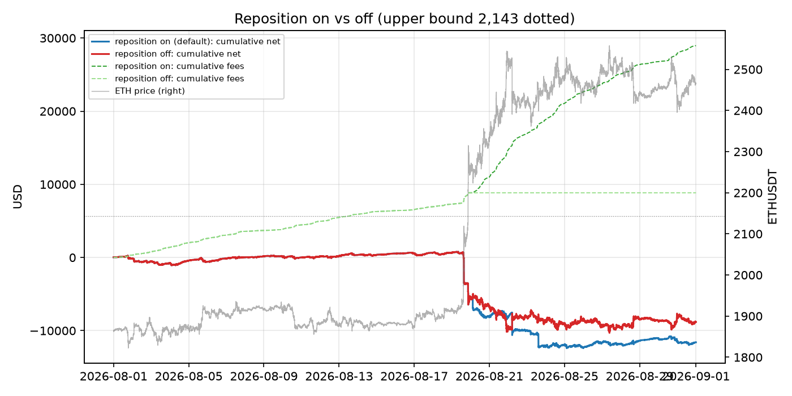

| | fees | hedge cost | gas | in range | net | net APR |
|---|---|---|---|---|---|---|
| on (default) | 28,956 | 3,540 | 540 | 98.2% | −11,592 | −11.39% |
| off | 8,846 | 1,085 | 0 | 44.5% | −8,812 | −8.66% |

ETH crossed 2,143 on Aug 19 and stayed above. Off: the position sat in USDC above the band for 55% of the swaps, earned no fees, carried no delta, and lost less. On: the re-strike at 2,251 bought a second helping of short gamma at a higher strike. Verdict: the re-strike rule is a momentum re-entry and August trended; property of the data. The rule is also the only reason the position stayed live for 98% of the flow.

### 8.10 Weekly sub-windows

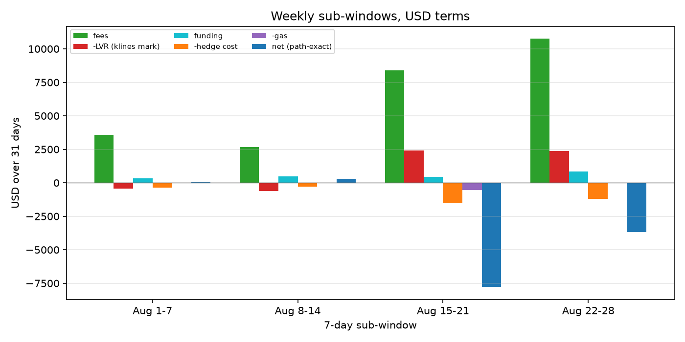

| week | swaps | fees | closed-form LVR | hedge cost | net | net APR |
|---|---|---|---|---|---|---|
| Aug 1-7 | 29,289 | 3,576 | 4,132 | 365 | +29 | +0.13% |
| Aug 8-14 | 25,236 | 2,664 | 2,314 | 275 | +312 | +1.35% |
| Aug 15-21 | 36,170 | 8,388 | 13,807 | 1,540 | −7,778 | −34.00% |
| Aug 22-28 | 49,769 | 10,751 | 13,726 | 1,205 | −3,667 | −15.44% |

Two flat weeks ended within 312 USD of zero. The week with the 3.48% minute, the exit through the band and the re-strike lost 7,778. Verdict: a short strangle that collects about 500 USD a day in calm weeks and gives back two and a half months of it in one trending week. Property of the strategy; the frequency of such weeks is the data.

### 8.11 Stress shock (hourly engine only)

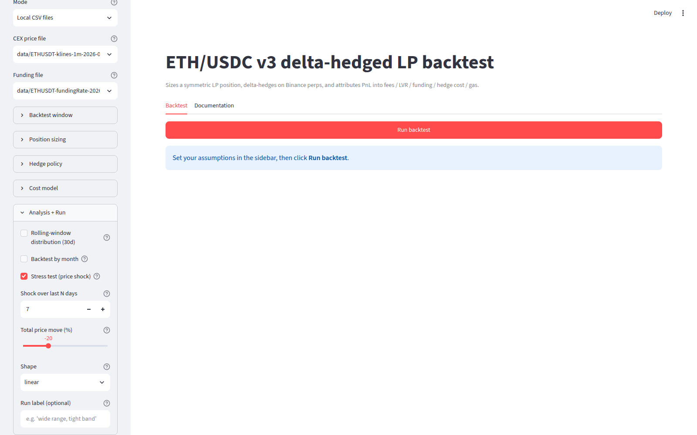

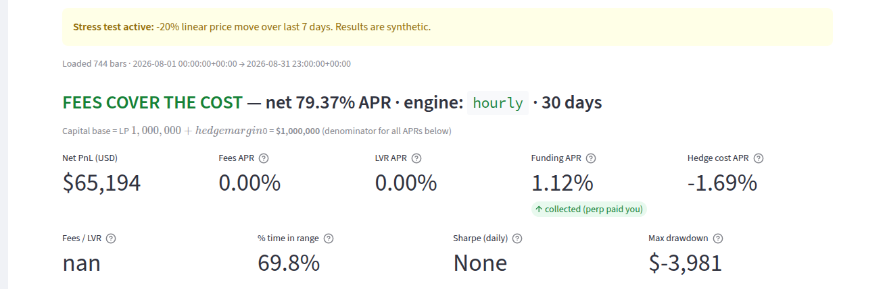

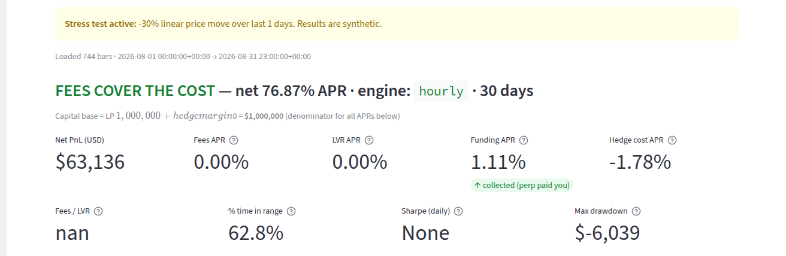

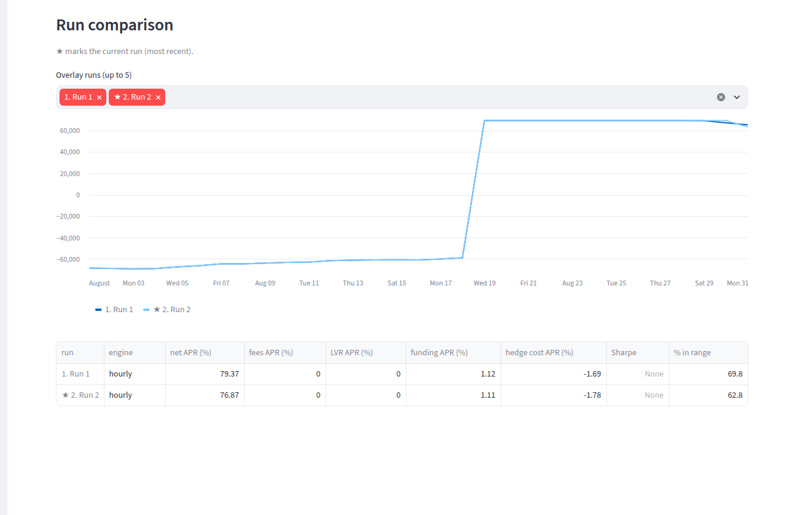

The stress test rewrites the OHLC bars of the last N days by a linear ramp or a step and reruns the hourly engine (app.py:1876-1905, 1944-1954); the swap tape and fees are untouched, so it does not exist for the reference engine. On screen, at the sidebar defaults (−20% linear over the last 7 days) the hourly engine reports `FEES COVER THE COST — net 79.37% APR` with `Fees APR 0.00%` and Net PnL $65,194; at −30% linear over 1 day, 76.87% and $63,136. From Python with `bt.Assumptions()` the same two runs give 65,320 and 63,269: the sidebar's taker-fee widget writes `binance_taker_fee = 4.5 / 10,000` (app.py:648) while the dataclass default is 0.0004, and rerunning with 0.00045 reproduces the screen numbers exactly (`raw/hourly_stress_ui_taker_check.txt`). A −30% step over 1 day gives −15,947. The 79,216 USD difference between the linear and step cases for the same end price is the hourly engine's sign error acting on 24 partial buy-backs versus one. The comparison chart makes the defect visible: both stress runs start the month at −60,000 (the 68,000 USD of capital the engine leaves unused at t0, `raw/hourly_hedge_sign_check.txt`) and jump to +65,000 on Aug 20 when the short is bought back above its average price. Verdict: a synthetic overlay on the engine with the defect; not evidence about anything.

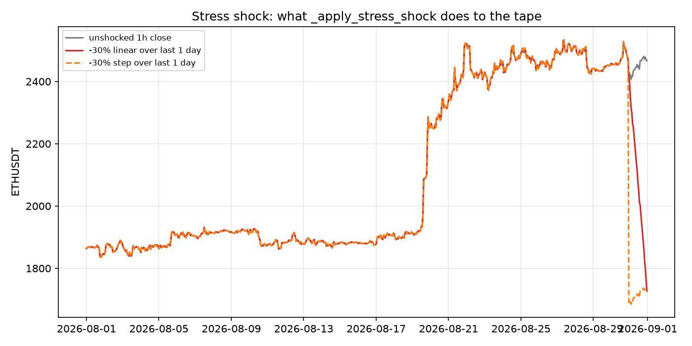

### 8.12 The app's own sweep

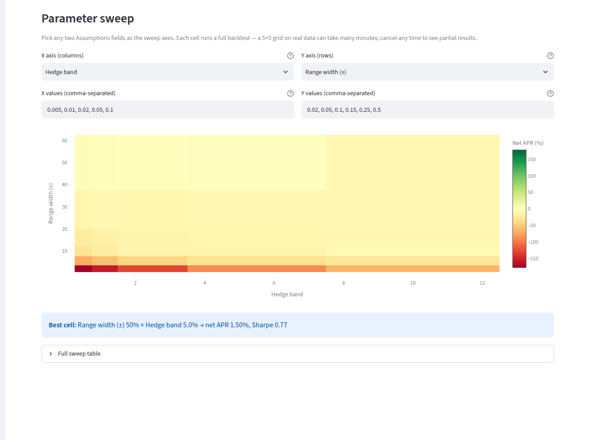

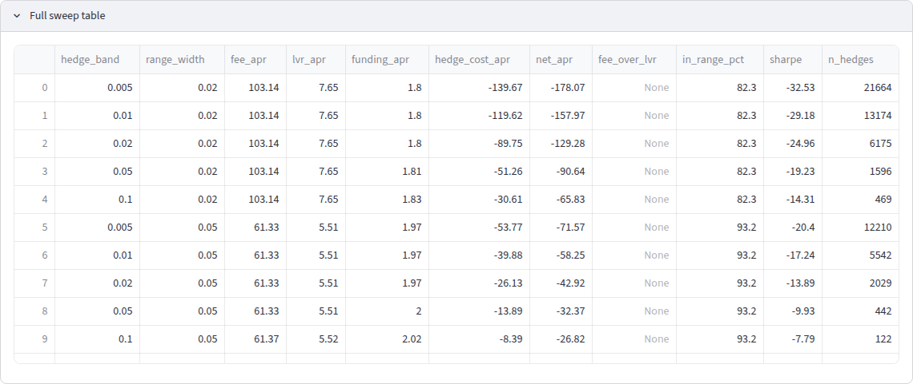

`Run range × hedge-band sweep` at the default grid: 30 cells, 15.8 s. The app's callout reads `Best cell: Range width (±) 50% × Hedge band 5.0% → net APR 1.50%, Sharpe 0.77`. That cell made 4 trades in 31 days; the neighbouring cell at band 10% made 2 and shows −8.73%. One trade's timing against a 32% trend separates them. The full 30-row table is in SCENARIOS.md section 12. Every cell with more than 25 trades is negative.

---

## 9. What this tells you and what it does not

What 31 real days demonstrate.

- A ±15% ETH/USDC 0.05% position, hedged every minute on a 3% band, ran at 28.5% fee APR and paid 37,963 USD of gamma in a month of 52% realised vol and a 32% trend. Fees covered 76% of the gamma before funding and execution. Net −11.4% annualised.
- The gamma cost is real and is measured three independent ways on real data to within 10% of each other. It is not a modelling artefact.
- The fee stream is real and is measured per swap against the pool's own volume, which reconciles to the chain's hourly aggregates to 0.01%.
- The position's fee APR falls as it grows because the pool is shallow: 2.7% of in-range liquidity at 1M, 21% at 10M.
- The band, grid and leverage controls move the answer by a few points; the range and the data move it by tens of points.

What they do not demonstrate.

- Whether the strategy is profitable. One month, one trend, one re-strike. The two flat weeks were flat, not profitable: 511 USD a day of fees against 590 USD a day of closed-form gamma in the first week. Nothing in the sample shows a week where fees beat gamma by a margin.
- Anything about a different pool, fee tier or month. Section 8.6 shows why the fee-tier sweep is not a substitute.
- Execution at size. The impact term is an assumption. The fill on the 441,856 USD re-hedge clip is a formula.
- The attribution tiles on the recommended price file. The `LVR APR` sign and the `Fees / LVR` tile are wrong on 1-minute klines (section 6).
- Anything from the `hourly` engine or the stress test (section 8.2, 8.11).
- Tail behaviour between blocks and between minutes. The 3.48% minute happened inside one hedge interval; the engine does not see what the fill would have been.

Before a trader sizes anything off this: a run of at least 6 to 12 months with the aggTrades tape so the attribution is clean; the same run through a calm quarter, because the sample has none; an impact model calibrated to the perp's book at the clip sizes the band produces; a liquidity-share model at swap resolution rather than hourly; and a fix for the reposition double count, which costs 540 USD per re-strike in `net_usd` today. The path-exact `net_usd` from the reference engine on real files is the one number in the app that survives all of the above unchanged.

---

## 10. Glossary

| Crypto term | Maps to | Introduced |
|---|---|---|
| Block | A 12-second batch of transactions; the tape's clock tick | 1.1 |
| Token (USDC, WETH) | A balance on the ledger; USDC is a dollar, WETH is ether | 1.2 |
| Smart contract | A program on the ledger that holds balances and executes fixed rules | 1.2 |
| Pool (Uniswap v3) | A passive market maker committed to a price schedule; the LP sells a fee stream and is picked off | 1.4 |
| Swap | A trade against the pool; one tape row | 1.2 |
| Liquidity provider (LP) | The holder of the short-gamma position in the pool | 1.4 |
| Liquidity L | The position's size parameter; value = L × f(√P); a narrower band gives larger L per dollar | 3 |
| Range, tick, tick spacing | Strikes of the strangle; quantised to 0.1% steps of price | 1.5, 1.6 |
| sqrtPriceX96 | The pool's price state, √P in 96-bit fixed point | 1.6 |
| In range | Between the strikes; the only state that earns fees or carries gamma | 1.5 |
| Reposition | Rolling the strangle to new strikes around spot, at a cost | 4 |
| Perpetual future | A linear future with no expiry pinned to spot by funding | 1.3 |
| Funding | Carry on the perp, paid every 8 hours; positive rate = longs pay shorts | 1.3 |
| LVR | The gamma bleed of the hedged position, ½σ²P²abs(V'') integrated along the path | 1.7, 6 |
| Impermanent loss | Divergence loss versus holding, evaluated at exit; path-independent; not used here | 1.7 |
| Subgraph / The Graph | A public index of chain events, queried for the swap tape | 2 |
| Klines | Binance's OHLC bars | 2 |
| aggTrades | Binance's trade-by-trade tape | 2 |
| Gas | The transaction fee paid to the chain | 4 |
| Markout | The taker's edge against the exchange price at a horizon after the trade | 4, 6 |

---

## Appendix A. Widget map

APP_MAP.md section 1 lists all 59 sidebar widget call sites (56 distinct labels; 33 to 38 rendered at once depending on engine and mode) and the 9 main-area widgets, each with label, key, type, default, range, the config field it writes, the function that consumes it, and whether it reaches an engine computation. The ones that do not reach any computation in some mode: `Perp leverage` and `Margin buffer` in the hourly engine (never passed to it); `Our share of pool active liquidity` and `Pool volume as fraction of Binance quote volume` in hourly Local CSV mode (volume is zeroed first); `Backtest window` in hourly Live mode. APP_MAP.md section 3.7 lists 23 places where the app's `Documentation` tab contradicts the code, including the `Swaps to (inclusive)` help text, the "2-3M swaps/month" caption, the claim that the legacy subgraph endpoint still works, and the claim that the hourly engine's `Local CSV` mode earns fees.

## Appendix B. File map of the repository

| File | Role |
|---|---|
| `app.py` (2,186 lines) | The Streamlit page: sidebar, run flow, renderers, documentation tab |
| `backtest.py` | The adapter: `Assumptions` dataclass, `run_swap_level`, `run_hourly`, data loaders, Binance and subgraph fetchers |
| `run_claude.py` | The reference engine: position math, per-swap attribution, hedge loop, summary, closed-form LVR, demo tape |
| `kimi/uniswap_delta_hedge_backtest.py` | The hourly engine (`DeltaHedgeBacktest`) and the live Binance fetcher (blocked from US addresses, 451) |
| `run_kimi.py`, `run_perplexity.py`, `run1.py` | Standalone scripts imported by nothing (APP_MAP.md 2.4) |
| `tests/` | 39 tests, all passing |
| `requirements.txt`, `nixpacks.toml`, `railway.toml`, `Procfile`, `DEPLOY.md` | Deployment on Railway |
| `data/` (gitignored) | Downloaded files; `data-cache/` in this branch holds the small ones |
| `docs/guide/` | This guide, its raw outputs, charts and screenshots |

## Appendix C. Reproduction commands

From the repository root with the data files in place (`cp data-cache/* data/`, then download the aggTrades file with the first command if wanted):

| Table or figure | Command |
|---|---|
| ENVIRONMENT.md self-test | `python3 -c "import backtest as bt; s,c,f=bt.make_demo_tape(days=25,s0=3000.0,vol_annual=0.65,seed=7); print(bt.run_swap_level(bt.Assumptions(),s,c,f).summary)"` |
| Binance files | `python3 -c "import backtest as bt; bt.ensure_all_data(start='2026-08',end='2026-08',cex_kind='klines',klines_interval='1m',include_pool_hourly=True); bt.ensure_all_data(start='2026-08',end='2026-08',cex_kind='klines',klines_interval='1h'); bt.ensure_binance_csvs(['2026-08'],kinds=('aggTrades',))"` |
| Swap tape (needs `THEGRAPH_API_KEY`) | `python3 docs/guide/raw/fetch_swaps.py && python3 docs/guide/raw/repair_swaps.py` |
| Section 2 checks and tape statistics | `python3 docs/guide/raw/data_checks.py` |
| Sections 3-6, 8.1, 8.3-8.10 (all swap_level runs) | `python3 docs/guide/raw/run_scenarios.py` |
| Section 8.2 and 8.11 (hourly engine, stress) | `python3 docs/guide/raw/run_hourly_stress.py && python3 docs/guide/raw/hourly_hedge_sign_check.py` |
| Section 7 through the UI, rolling, by-month, section 8.12 sweep | `python3 docs/guide/raw/apptest_runs.py` |
| Section 3 derivations | `python3 docs/guide/raw/guide_derivations.py` |
| Charts | `python3 docs/guide/raw/make_charts.py` |
| Screenshots | `python3 docs/guide/raw/shots_live.py`, `shots_live2.py`, `shots_local_a.py`, `shots_local_b.py`, `shots_local_c.py`, `shots_local_d.py` (Playwright; captions in `screenshots/INDEX.md`) |
| Formula checks (SOURCES.md) | `python3 docs/guide/raw/sources_check.py` |
| This document as .docx | `python3 docs/guide/raw/build_docx.py` |
